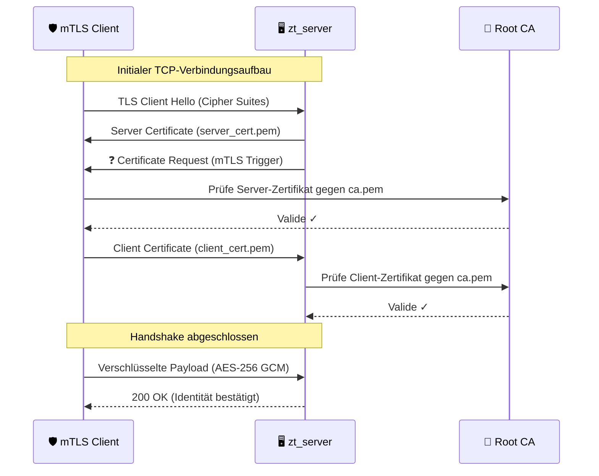

# 🛡️ Zero-Trust-Architektur: mTLS C++ Microservices

   [](https://DEIN_USER.github.io/REPRO_NAME/) [](https://opensource.org/licenses/MIT)
Dieses Projekt demonstriert eine hochsichere **Service-to-Service Kommunikation** in verteilten Systemen. Es wurde als technischer Proof-of-Concept für zwei zentrale Säulen moderner Softwareentwicklung entworfen:

1.  **Moderne Asynchronität:** Nutzung von **C++20 Coroutinen** in Verbindung mit **Boost.Asio**, um hocheffiziente, nicht-blockierende Netzwerkoperationen bei gleichzeitig lesbarem Code-Fluss zu ermöglichen.
2.  **Sicherheit durch Design (DSA-Compliance):** Im Kontext des **Digital Services Act (DSA)** der EU rücken Sicherheit, Identitätsprüfung und der Schutz digitaler Infrastrukturen in den Fokus. Diese Implementierung nutzt **mTLS (Mutual TLS)**, um eine Zero-Trust-Umgebung zu schaffen, in der jeder Dienst seine Identität kryptographisch nachweisen muss.

---

## 🚀 Features

* **Mutual TLS (mTLS):** Beidseitige Zertifikatsprüfung (Server prüft Client, Client prüft Server).
* **C++20 Standard:** Nutzung von `std::format`, `std::chrono` und moderner Speicherverwaltung.
* **Zero-Trust-Prinzip:** Kein Vertrauen ohne explizite Identitätsbestätigung.
* **Docker-Native:** Vollständig isolierte Umgebung für reproduzierbare Tests.

---

## 🛠️ Voraussetzungen

Das Projekt ist für die Nutzung mit **VS Code DevContainers** optimiert, was die Installation von Abhängigkeiten (OpenSSL, Boost, CMake) auf deinem lokalen System überflüssig macht.

* **Windows:** Docker Desktop + WSL2.
* **Linux/Mac:** Docker + Docker Compose.
* **IDE:** VS Code mit der Extension *Dev Containers*.

---

## 🏗️ Tech-Stack & Spezifikationen

* **Architektur:** Microservices (C++20)
* **Betriebssystem:** Debian Trixie (Slim Image) / Windows (via MSYS2 UCRT64)
* **Compiler:** GCC 15.2.0 (UCRT64 unter Windows)
* **Bibliotheken:**
  * **Boost.Asio:** Für asynchrone Netzwerkkommunikation.
  * **OpenSSL:** Für die kryptografische Absicherung und Zertifikatsverwaltung.
* **Protokoll:** mTLS über TCP/IP auf **Port 8443**.

---

## 🔐 Sicherheits-Infrastruktur (Zertifikate)

Die Identitätsprüfung basiert auf einer internen Root-CA. Zertifikate werden mit `Subject Alternative Names` (SAN) generiert.

* **Generierung:** `./generate_san_certs.sh` (Erstellt CA, Server- & Client-Keys).
* **Struktur:** Alle Zertifikate befinden sich in `./bin/certs/`.

---

## 🚀 Startanleitung

### Option A: Docker Compose (VS Code DevContainer)

1. Klone das Repository: `git clone https://github.com/franzsteinkress/Zero-Trust-Architektur.git`
2. Öffne den Ordner in VS Code.
3. Bestätige die Meldung **"Reopen in Container"** (unten rechts).
4. Starte die Umgebung:
```bash
docker-compose up --build

```

**Beispiel für die Konsolen-Ausgabe:**

```text
zt_server  | [20:45:36.083] [SERVER ] [INFO ] Server gestartet auf Port 8443...
zt_client  | [20:45:36.342] [SYSTEM ] [INFO ] Starte Client-Verbindung zu: zt_server
zt_server  | [20:45:36.363] [SERVER ] [INFO ] Neue Verbindung von: 172.19.0.3
zt_client  | [20:45:36.363] [CLIENT ] [INFO ] Starte mTLS Handshake...
zt_server  | [20:45:36.373] [SERVER ] [INFO ] mTLS Handshake erfolgreich!
zt_client  | [20:45:36.372] [CLIENT ] [INFO ] ERFOLG: Verbindung ist sicher.
zt_server  | [20:45:36.373] [SERVER ] [INFO ] VERIFIZIERT: Client: /CN=client-app
zt_client  | [20:45:36.373] [CLIENT ] [INFO ] --- Server Antwort Start ---
zt_client  | HTTP/1.1 200 OK
zt_client  | Identität bestätigt. Zugriff gewährt.
zt_server  | [20:45:36.373] [SERVER ] [INFO ] BINÄRE DATEN VERIFIZIERT: [ID: 42 | Temp: 22.5°C]
zt_client exited with code 0

```

### Option B: Natives Testen (MSYS2 UCRT64)

1. **Terminal 1 (Server):** `./bin/mtls_app server`
2. **Terminal 2 (Client):** `./bin/mtls_app client localhost`

---

## ⌨️ VS Code "Cheat Sheet" (Windows / MSYS2)

Nutze `Strg + Shift + P` für folgende Aktionen:

* `Terminal: Select Default Profile` -> **MSYS2 UCRT64**
* `CMake: Select a Kit` -> **GCC 15.2.0 UCRT64**
* `CMake: Configure` / `CMake: Build`
* `CMake: Delete Cache and Reconfigure` (bei Build-Problemen)

---

## 🐳 Docker "Cheat Sheet"

* `docker-compose up` / `down`: Start/Stopp der Services.
* `docker-compose logs -f`: Live-Logs verfolgen.
* `docker system prune`: Aufräumen ungenutzter Docker-Ressourcen.

---

## 🔍 Debugging

* **Handshake-Fehler:** Systemzeit prüfen (Zertifikatsgültigkeit!).
* **Verbindung abgelehnt:** Prüfen, ob Port **8443** frei ist.
* **Docker-Host:** In Docker-Netzwerken immer den Servicenamen `zt_server` statt `localhost` verwenden.

### 📚 Log-Aufbereitung & Analyse (PowerShell)

In einer verteilten Architektur schreiben Client und Server ihre Logs gleichzeitig in den Docker-Stream. Um den exakten Ablauf des mTLS-Handshakes und der Datenübertragung nachzuvollziehen, bietet das Projekt ein intelligentes Analyse-Skript:

* **Skript:** `sort_logs.ps1`
* **Funktionen:**
    * **Kernfunktion:** Liest Log-Dateien ein, extrahiert die Zeitstempel (ISO 8601) und gibt eine chronologisch sortierte Gesamtansicht aus.
    * **Automatisierung:** Extrahiert die Logs direkt aus den laufenden Docker-Containern (kein manuelles Umleiten in Dateien nötig).
    * **Kontext-Sortierung:** Erkennt zusammenhängende Blöcke (z. B. HTTP-Header oder Bestätigungstexte ohne eigenen Zeitstempel) und hält sie chronologisch bei ihrer Ursprungs-Nachricht.
    * **Bereinigung:** Entfernt leere "Ghost-Logs" und System-Rauschen von Docker-Compose.
    * **Encoding-Fix:** Erzwingt UTF-8 für eine fehlerfreie Darstellung von Umlauten (z. B. "Identität") in der Windows-Konsole.

#### 🚀 Anwendung & Log-Analyse

Um die mTLS-Kommunikation und den Handshake im Detail zu analysieren, muss das PowerShell-Skript ausgeführt werden, während die Logs in Docker noch verfügbar sind. Hierfür gibt es zwei bewährte Wege:

**Option 1: Der "Post-Mortem" Weg (Standard)**
Dieser Weg eignet sich, wenn du den gesamten Prozess von Start bis Ende (inkl. Shutdown) analysieren möchtest.
1. Container starten: `docker-compose up`
2. Interaktion abwarten (mTLS Handshake & Datentransfer).
3. Container mit `Ctrl+C` beenden.
4. Analyse-Skript ausführen:
   ```powershell
   ./sort_logs.ps1
   ```
5. (Optional) Ressourcen vollständig entfernen: `docker-compose down`

**Option 2: Der "Detached Mode" (Live-Snapshot)**
Ideal, wenn du die Logs analysieren willst, während die Server im Hintergrund weiterlaufen.
1. Container im Hintergrund starten:
   ```powershell
   docker-compose up -d
   ```
2. Analyse-Skript jederzeit ausführen (erzeugt einen Snapshot der aktuellen Logs):
   ```powershell
   ./sort_logs.ps1
   ```
3. Nach Abschluss die Container manuell stoppen: `docker-compose stop` oder `docker-compose down`.

**📊 Ergebnis:**
Das Skript generiert die Datei `sorted_logs.txt`. Darin ist die Kommunikation zwischen Client und Server chronologisch perfekt verzahnt, von "Ghost-Logs" bereinigt und in korrektem UTF-8-Encoding aufbereitet.

---

## 📖 Dokumentation (Doxygen)

Der Code ist nach dem Doxygen-Standard kommentiert. Um die HTML-Dokumentation lokal zu generieren:

1. Installiere Doxygen: `sudo apt install doxygen` (Linux) oder `choco install doxygen` (Windows).
2. Führe im Root-Verzeichnis aus: `doxygen Doxyfile`
3. Öffne `docs/html/index.html` im Browser.

Die technische Referenz kann mit **Doxygen** lokal generiert werden:
1. `doxygen Doxyfile`
2. Öffne `html/index.html` im Browser.

---

## 📊 System-Architektur

1. **Handshake:** Gegenseitiger Zertifikatsaustausch.
2. **Verifikation:** Validierung gegen die Root-CA.
3. **Verschlüsselung:** Aufbau des gesicherten Tunnels.
4. **Datentransfer:** Übertragung der binären Sensor-Payload.

### 🔄 Der mTLS Handshake-Prozess (Detail)

In einer Zero-Trust-Umgebung reicht es nicht, wenn der Client dem Server vertraut. Der Server muss die Identität des Clients aktiv einfordern und validieren, bevor ein einziges Byte an Anwendungsdaten fließt.

1.  **Client Hello:** Client sendet unterstützte Cipher Suites.
2.  **Server Hello & Certificate:** Server sendet sein Zertifikat (`server_cert.pem`).
3.  **Certificate Request:** Der Server fordert explizit das Zertifikat des Clients an.
4.  **Client Certificate & Key Exchange:** Client sendet sein Zertifikat (`client_cert.pem`) und beweist den Besitz des privaten Schlüssels.
5.  **Validation:** Beide Seiten prüfen die Signaturen gegen die gemeinsame `ca.pem`.
6.  **Encrypted Channel:** Nach erfolgreicher beidseitiger Verifikation wird der symmetrische Sitzungsschlüssel für die AES-Verschlüsselung generiert.



#### 🔐 Kryptographische Details
Um eine maximale Sicherheit und Kompatibilität innerhalb des Docker-Netzwerks zu gewährleisten, nutzt die Implementierung folgende Standards:
* **Subject Alternative Name (SAN):** Die Zertifikate sind auf die internen Docker-DNS-Namen (`zt_server`, `zt_client`) ausgestellt, um Hostname-Mismatches zu verhindern.
* **Zertifikats-Workflow:** Vollautomatisierte Erstellung von **CSRs** (Certificate Signing Requests), die unmittelbar durch die lokale Root-CA signiert werden.
* **Cipher Suites:** Fokus auf **TLS 1.3** mit sicherem Schlüsselaustausch (ECDHE) und authentifizierter Verschlüsselung (AES-GCM).

#### 🏗️ Architektur-Prinzipien & Standards

* **Identitätsmanagement:** Strikte **Authentifizierung via X.509-Zertifikaten**. Jeder Dienst weist seine Identität kryptographisch nach, bevor eine Kommunikation erlaubt wird.
* **PKI (Public Key Infrastructure):** Eine integrierte, OpenSSL-basierte PKI verwaltet den gesamten Lebenszyklus der Zertifikate (Erstellung, Signierung durch Root-CA).
* **Service-to-Service Security:** Das Projekt dient als Blueprint für sichere Kommunikation in **verteilten Systemen** oder **Kubernetes (K8s)** Umgebungen (ähnlich wie ein Service Mesh wie Istio oder Linkerd arbeitet).
* **Interoperabilität:** Der Server ist standardkonform. Er kann nicht nur von unserem C++ Client, sondern auch via **curl** (unter Angabe der Zertifikatspfade) angesprochen werden.

### 🗺️ Netzwerk-Topologie (Docker-Infrastruktur)

Die Kommunikation findet innerhalb eines isolierten Docker-Netzwerks statt, um die Microservices von externen Einflüssen abzuschirmen.

* **Service `zt_server`:** Fungiert als Policy Enforcement Point (PEP). Er lauscht auf Port `8443` und lehnt jede Verbindung ohne gültiges `client-app` Zertifikat sofort ab.
* **Service `zt_client`:** Besitzt die Identität `client-app`. Er ist so konfiguriert, dass er nur dem Server vertraut, der ein von der `ZeroTrust Root CA` signiertes Zertifikat vorlegt.
* **Isolierung:** Da beide Container im selben Docker-Netzwerk liegen, erfolgt die Auflösung über den internen DNS-Namen `zt_server`, was Hardcoded-IPs überflüssig macht.


### 📝 Zusammenfassung der Sicherheitsgarantien

| Schutz gegen... | Mechanismus | Status |
| :--- | :--- | :--- |
| **Eavesdropping** | TLS 1.3 Verschlüsselung | ✅ Aktiv |
| **Impersonation** | Zertifikats-Validierung (mTLS) | ✅ Aktiv |
| **Man-in-the-Middle** | Root-CA Trust-Chain & SAN Prüfung | ✅ Aktiv |
| **Unauthorized Access** | Zero-Trust Identity Matching (CN) | ✅ Aktiv |

---

## 🤖 Automatisierung & CI/CD

Das Projekt wurde um eine **vollautomatisierte Identitäts-Infrastruktur** erweitert, um sowohl lokale Entwicklung als auch Cloud-Builds ohne manuelles Eingreifen zu ermöglichen.

### 🔄 Automatisierter Build-Flow
* **Lokaler Build (CMake):** Beim ersten Aufruf von `cmake` prüft das System, ob das Verzeichnis `./bin/certs/` existiert. Falls nicht, wird `file(MAKE_DIRECTORY)` ausgeführt und das Skript `generate_san_certs.sh` automatisch getriggert.
* **GitHub Actions:** Bei jedem `push` wird ein Docker-Image auf Basis von **Debian Trixie** gebaut. Die Zertifikate werden **während des Build-Prozesses im Container** generiert. Das fertige Image ist dadurch vollkommen autark ("Self-Contained").

### 📦 GitHub Container Registry (GHCR)
Das stabile Image steht in der Registry zur Verfügung und kann ohne lokalen Quellcode getestet werden:
```bash
# Image aus der Registry beziehen
docker pull ghcr.io/franzsteinkress/zt-app-trixie:latest

# Server direkt aus dem Cloud-Image starten
docker run -it --rm ghcr.io/franzsteinkress/zt-app-trixie:latest server
```

---

## 🔐 Kryptografische Spezifikationen

Die nachfolgende Tabelle beschreibt die technischen Details der verwendeten Verschlüsselung, wie sie im `generate_san_certs.sh` konfiguriert ist:

| Komponente | Algorithmus / Parameter | Detail-Spezifikation |
| :--- | :--- | :--- |
| **Root-CA Key** | RSA | **4096 Bit** (Hochsicherheits-Standard) |
| **Entity Keys** | RSA | **2048 Bit** (Server & Client) |
| **Signatur-Hash** | SHA-256 | Sicherer Digest für Zertifikatssignaturen |
| **Gültigkeit** | 3650 Tage | **10 Jahre** (Long-term Testidentitäten) |
| **TLS-Erweiterung** | SAN | Subject Alternative Names für `zt_server`, `localhost` |
| **Key Usage** | Extended Key Auth | `serverAuth` (Server) / `clientAuth` (Client) |


### 🛡️ Zero-Trust Security Hinweis
Obwohl die privaten Schlüssel (`.key`) im Image enthalten sind (um die Demonstration zu vereinfachen), folgt das Projekt dem **Zero-Trust-Paradigma**:
1. **Verifizierung vor Kommunikation:** Kein Dienst vertraut dem anderen ohne gültiges Zertifikat.
2. **Explizite Identität:** Die `Common Name` (CN) Prüfung stellt sicher, dass nur die `client-app` Zugriff auf den `zt_server` erhält.
3. **Isolierung:** Die Schlüssel sind im Runtime-Image unter `/app/` geschützt abgelegt.

---

## 📄 Lizenz

Dieses Projekt ist unter der **MIT-Lizenz** lizenziert. Siehe die [LICENSE](./LICENSE)-Datei für Details.

*„Frei verwendbar für Ausbildung, Demonstration und als Basis für eigene Zero-Trust-Implementierungen.“*

---


Hier ist die aufbereitete Fassung für deine **README.md**. Ich habe die Optionen klar strukturiert und die Befehle in Code-Blöcke gesetzt, damit Nutzer sie direkt kopieren können.

---

#### 🚀 Anwendung & Log-Analyse

Um die mTLS-Kommunikation und den Handshake im Detail zu analysieren, muss das PowerShell-Skript ausgeführt werden, während die Logs in Docker noch verfügbar sind. Hierfür gibt es zwei bewährte Wege:

**Option 1: Der "Post-Mortem" Weg (Standard)**
Dieser Weg eignet sich, wenn du den gesamten Prozess von Start bis Ende (inkl. Shutdown) analysieren möchtest.
1. Container starten: `docker-compose up`
2. Interaktion abwarten (mTLS Handshake & Datentransfer).
3. Container mit `Ctrl+C` beenden.
4. Analyse-Skript ausführen:
   ```powershell
   ./sort_logs.ps1
   ```
5. (Optional) Ressourcen vollständig entfernen: `docker-compose down`


**Option 2: Der "Detached Mode" (Live-Snapshot)**
Ideal, wenn du die Logs analysieren willst, während die Server im Hintergrund weiterlaufen.
1. Container im Hintergrund starten:
   ```powershell
   docker-compose up -d
   ```
2. Analyse-Skript jederzeit ausführen (erzeugt einen Snapshot der aktuellen Logs):
   ```powershell
   ./sort_logs.ps1
   ```
3. Nach Abschluss die Container manuell stoppen: `docker-compose stop` oder `docker-compose down`.


---

**📊 Ergebnis:**
Das Skript generiert die Datei `sorted_logs.txt`. Darin ist die Kommunikation zwischen Client und Server chronologisch perfekt verzahnt, von "Ghost-Logs" bereinigt und in korrektem UTF-8-Encoding aufbereitet.

---

### Ein kleiner technischer Tipp vor dem Check-in:
Falls du dich für **Option 1** entscheidest, achte darauf, dass du nach dem `Ctrl+C` kurz wartest, bis der PowerShell-Prompt wieder erscheint, bevor du das Skript startest. So stellst du sicher, dass Docker alle Log-Buffer auf die Festplatte geschrieben hat.

**Soll ich dir noch helfen, einen kurzen "Troubleshooting"-Abschnitt für die README zu schreiben, falls mal ein Port belegt ist oder Zertifikate fehlen?**